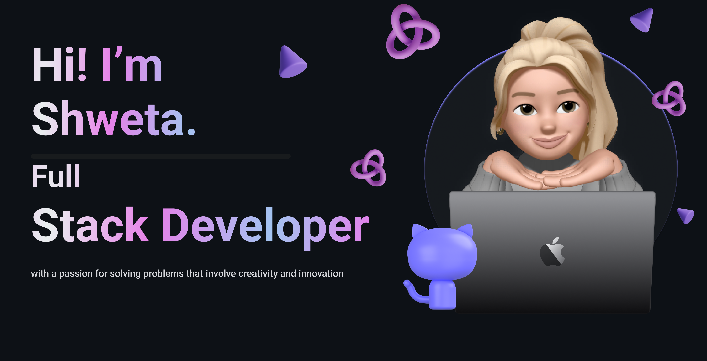

  &nbsp;&nbsp;

  &nbsp;&nbsp;

  &nbsp;&nbsp;

  &nbsp;&nbsp;

  &nbsp;&nbsp;

   &nbsp;&nbsp;

  

#  About Me! 
*Frontend Developer (Developer / Programmer)*
 

<!--Start Intro-->

Frontend Developer specializing in React, JavaScript, HTML, and CSS, passionate about creating clean and responsive user interfaces.

- ✨ Student of life :)  
- 💻 Interested in Frontend Development & Web Design 
- 🌱 I’m currently learning many things, I believe that everyday is a learning opportunity. 
- 🎯 Focused on improving DSA & coding skills 
- ❤ Contributing to Open Source. 
- 📝 Exploring GitHub, open-source, and real-world projects 
- 🚀 Preparing myself for industry-level roles 
   

  

<h2 align="center">Tᴇᴄʜ sᴛᴀᴄᴋ & Lᴀᴛᴇsᴛ ʙʟᴏɢs</h2> 

  <table>
    <tr>
      <td align="center" width="96">
        
         HTML
      </td>
     <td align="center" width="96">
        
         CSS
      </td>
      <td align="center" width="96">
        
         JavaScript
      </td>
       <td align="center" width="96">
        
         React
      </td>
      <td align="center" width="96">
        
         Java
      </td>
      <td align="center" width="96">
        
         GitHub
      </td>
      <td align="center" width="96">
        
         Git
      </td>
    </tr>
  </table>

<h2 align="center">📊 Gɪᴛʜᴜʙ Sᴛᴀᴛs 📊</h2>

     
     

   
   
   

<picture>
  <source media="(prefers-color-scheme: dark)" srcset="https://raw.githubusercontent.com/Shwetadudye/Shwetadudye/output/pacman-contribution-graph-dark.svg">
  <source media="(prefers-color-scheme: light)" srcset="https://raw.githubusercontent.com/Shwetadudye/Shwetadudye/output/pacman-contribution-graph.svg">
  
</picture>

  
