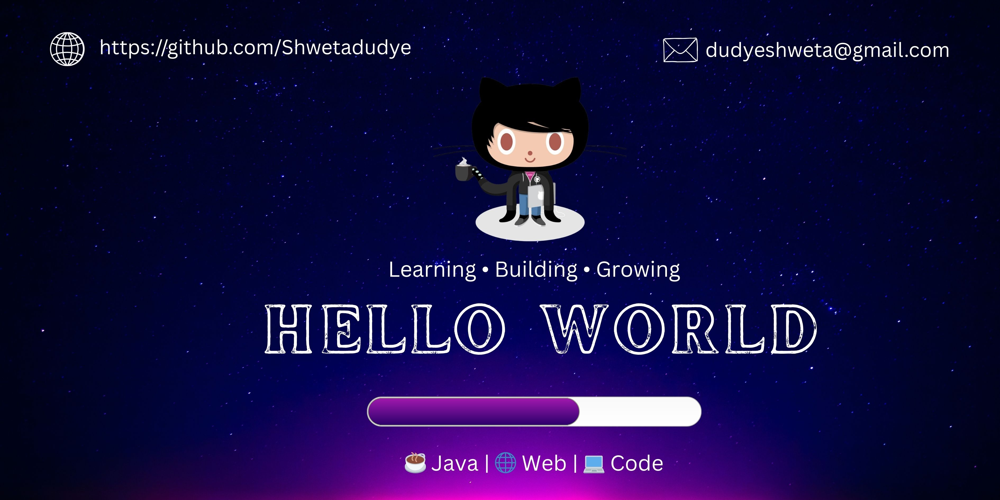

  

#  ɪ'ᴍ ꜱʜᴡᴇᴛᴀ ᴅᴜᴅʏᴇ!
*Frontend Developer | JavaScript Enthusiast*
 

<!--Start Intro-->

Frontend Developer specializing in React, JavaScript, HTML, and CSS, passionate about creating clean and responsive user interfaces.

- ✨ Student of life :)  
- 💻 Interested in Frontend Development & Web Design 
- 🌱 I’m currently learning many things, I believe that everyday is a learning opportunity. 
- 🎯 Focused on improving DSA & coding skills 
- ❤ Contributing to Open Source. 
- 📝 Exploring GitHub, open-source, and real-world projects 
- 🚀 Preparing myself for industry-level roles 
   

  

<h2 align="center">Tᴇᴄʜ sᴛᴀᴄᴋ & Lᴀᴛᴇsᴛ ʙʟᴏɢs</h2> 
<picture>
  <source media="(prefers-color-scheme: dark)" srcset="./Skills_Animation_Dark.gif">
  <source media="(prefers-color-scheme: light)" srcset="./Skills_Animation_White.gif">
  
</picture>
 
<h3 align="left">Current Learning</h3>
<ul align="left">
  <li>Strengthening my understanding of JavaScript and modern frontend concepts.</li>
  <li>Learning React.js fundamentals, hooks, and component-based architecture.</li>
  <li>Improving UI/UX skills using HTML, CSS, and responsive design principles.</li>
  <li>Practicing Data Structures & Algorithms for better problem-solving.</li>
  <li>Exploring backend basics to become a full-stack developer.</li>
</ul>
 
 
 
 

<h2 align="center">📊 Gɪᴛʜᴜʙ Sᴛᴀᴛs 📊</h2>

<table width="100%">
  <tr>
    <td width="50%">
      <h3 align="center"><strong>Gɪᴛʜᴜʙ Sᴛᴀᴛs</strong></h3>
      

        
      

    </td>
    <td width="50%">
      <h3 align="center"><strong>Sᴛʀᴇᴀᴋ Sᴛᴀᴛs</strong></h3>
      

        
      

    </td>
  </tr>
 <!-- <tr>
    <td width="50%">
      <h3 align="center"><strong>Lᴀᴛᴇsᴛ Pʀᴏᴊᴇᴄᴛ</strong></h3>
      

        
      

    </td>-->
    <td width="50%">
      <h3 align="center"><strong>Tᴏᴘ Cᴏɴᴛʀɪʙᴜᴛɪᴏɴs</strong></h3>
      

        
      

    </td>
  </tr>
</table>
 

<!--Contribution Graph-->
<h2 align="center">📈 Cᴏɴᴛʀɪʙᴜᴛɪᴏɴ Gʀᴀᴘʜ 📈</h2>

    

---

<!--Dynamic Quote card updates everyday at 12 PM--> 
<h2 align="center">🌟 Tʜᴏᴜɢʜᴛ ᴏғ ᴛʜᴇ Dᴀʏ 🌟</h2>

<!--STARTS_HERE_QUOTE_CARD-->

    

<!--ENDS_HERE_QUOTE_CARD-->

<!--Contact Section--> 

<h2 align="center">🤝 Cᴏɴɴᴇᴄᴛ Wɪᴛʜ Mᴇ 🤝 </h2>

  

 

<!--Footer--> 

  

  
